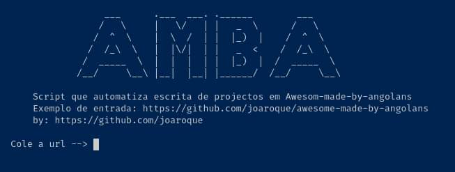

<div align="center">
  
# AMBA - Awesome Made by Angolans

> Script que automatiza escrita de projectos.



</div>

## REQUER

- Python3
- requests
- json

## COMO USAR

```sh
python amba.py
```

- Cole (digite) a URL do repositório que queres extrair informações.
- Os detalhes do repostório estará em: `./amba-repos/output.txt`
- Em seguida o ‘bot’ do programa vai fazer o pull-request usando os seus dados, para o repositório: [Awesome-made-by-angolans](https://github.com/joaroque/awesome-made-by-angolans)
- Aguarde até que algum responsável aceite a sua contribuição e atualize os dados.

### Exmplo de saída no arquivo `output.txt`

```md
- **[amba](https://github.com/joaroque/amba)** by [Joaquim Roque](https://github.com/joaroque)   
    Ferramenta para automatizar a escrita de projectos no reposiório https://github.com/joaroque/awesome-made-by-angolans  
    
```

### Como ficará renderizado no GitHub(Markdown)

- **[amba](https://github.com/joaroque/amba)** by [Joaquim Roque](https://github.com/joaroque) \
    Ferramenta para automatizar a escrita de projetos no reposiório <https://github.com/joaroque/awesome-made-by-angolans> \
   

## CONTRIBUIR
- Faça fork do projecto
- Crie uma nova branch
- Faça pull request na branch `dev`

>> Seu código será revisado e talvéz aprovado :smile:

## REPOSITÓRIO
[Awesome-made-by-angolans](https://github.com/joaroque/awesome-made-by-angolans)
